<p align="center">
  
</p>

<h1 align="center">步步精心｜意外事件影像辨識系統</h1>

<h4 align="center">讓每一步都有系統守護</h4>

<p align="center">
  <a href="https://github.com/AIPE03-3/BuBuCare/actions/workflows/backend-tests.yml"></a>
  <a href="https://github.com/AIPE03-3/BuBuCare/actions/workflows/guardrails.yml"></a>
  
  
  
  
  
  
  
  
  
</p>

以電腦視覺自動偵測長照機構內的意外事件，即時通知護理站，並保留影像證據供人工複判，複判結果再回流成為模型的訓練資料。

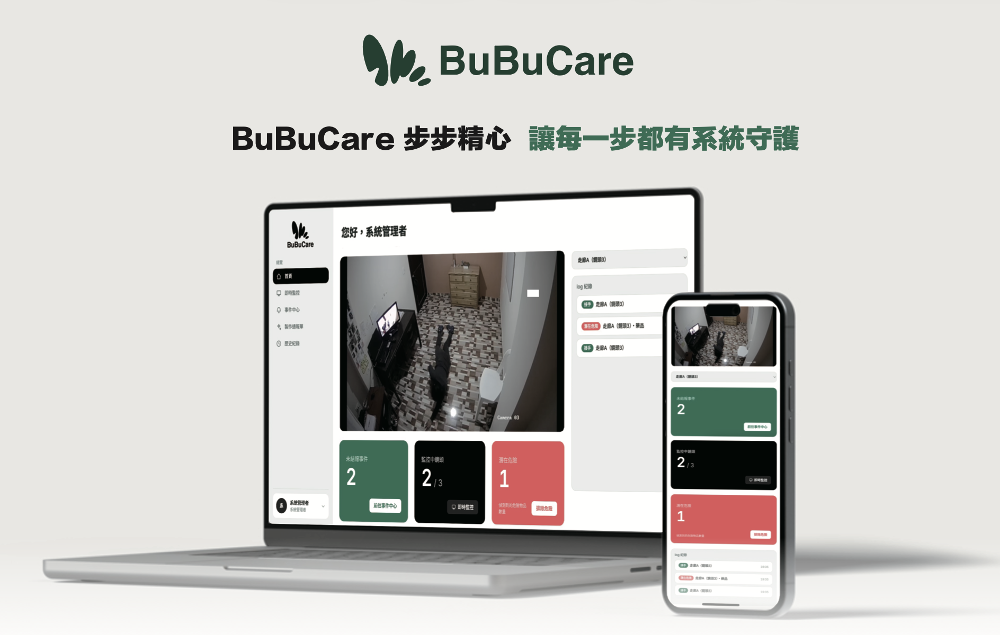

---

## 目錄

1. [專案簡介](#1-專案簡介)
2. [畫面 Demo](#2-畫面-demo)
3. [系統架構](#3-系統架構)
4. [影像串流](#4-影像串流)
5. [模型介紹](#5-模型介紹)
6. [推論平台](#6-推論平台)
7. [低信心複審機制](#7-低信心複審機制)
8. [事件匯流](#8-事件匯流)
9. [後端設計](#9-後端設計)
10. [資料庫設計](#10-資料庫設計)
11. [系統監控與營運](#11-系統監控與營運)
12. [Data Flywheel](#12-data-flywheel)

---

## 1. 專案簡介

臺灣已進入超高齡社會，2026年台灣65歲以上人口佔比百分之21，2070年撫養比將會達到1:1，可以預期照護人力不足。

而意外事件對長輩的生命威脅極大，其中跌倒是臺灣老人意外傷害死亡原因第二位，且黃金救援時間為一小時，凸顯了及時發現意外事件的重要性。

傳統做法有兩條路：(1) 傳統人力巡房，但受班表與人力配置限制，無法連續覆蓋所有時段與空間；(2) 穿戴式偵測裝置，依賴被照顧者持續配戴，實務上的配戴率與電池維護是長期問題。而本系統選擇**以既有攝影機為輸入，用多模型協同判定取代單一規則，並且在架構層面內建人工複判與資料回流機制。**

系統要達成四個主要目標：

1. **自動偵測**：從連續影像中判斷意外事件，不需要被照顧者配戴任何裝置
2. **即時通知**：確定性高的事件零延遲送達護理站，不等任何後續處理
3. **保留證據**：每一筆事件都附帶事發前後的影片片段與快照，供人工回放確認
4. **持續改善**：人工複判的結果回流為訓練資料，模型隨著使用時間而變準

### 1.1 現階段的實作範圍

系統定位是意外事件偵測，**目前已實作的偵測項目為跌倒**。

架構上偵測模型與後續流程是分開的：事件通報、人工複判、影像存證與資料回流
完全不依賴事件類型。新增其他意外類型（例如夜間離床、輪椅滑落）需要的是
對應的偵測邏輯與模型版本，通報鏈路不必改動。

因此本文件在描述**系統能力與設計**時使用「意外事件」，
在描述**目前模型的實際輸出與介面文字**時使用「跌倒」。

---

### 1.2 技術總覽

| 層級     | 技術                                                           |
| -------- | -------------------------------------------------------------- |
| 影像串流 | MediaMTX（RTSP 收流、WebRTC 送瀏覽器）、PyAV（邊緣端拉流解碼） |
| 推論服務 | NVIDIA Triton Inference Server（ONNX Runtime、TensorRT）       |
| 偵測模型 | YOLO11-Pose、RT-DETR、Action Transformer                       |
| 複審模型 | Ollama 地端部署的視覺語言模型                                  |
| 決策流程 | LangGraph                                                      |
| 事件匯流 | Apache Kafka（KRaft 模式）                                     |
| 後端     | FastAPI、Python 3.12                                           |
| 前端     | React 19、TypeScript、Tailwind CSS 4、Vite                     |
| 資料儲存 | PostgreSQL（AWS RDS）、AWS S3                                  |
| 監控     | Prometheus、Netdata、Grafana                                   |
| MLOps    | Label Studio、ClearML                                          |

---

## 2. 畫面 Demo

中控台共七個功能頁，另有管理者專屬的使用者管理。點擊標題展開說明與圖片。

<details>
<summary><b>首頁</b>　即時監控與當班概況</summary>

<br>

四路鏡頭同時串流，骨架與動作分類結果由瀏覽器即時疊在畫面上，
每格可獨立切換骨架與 HUD 顯示。下方是當班需要的兩個數字：未結報事件與監控中鏡頭數。
右側欄列出尚未有人回應的事件。

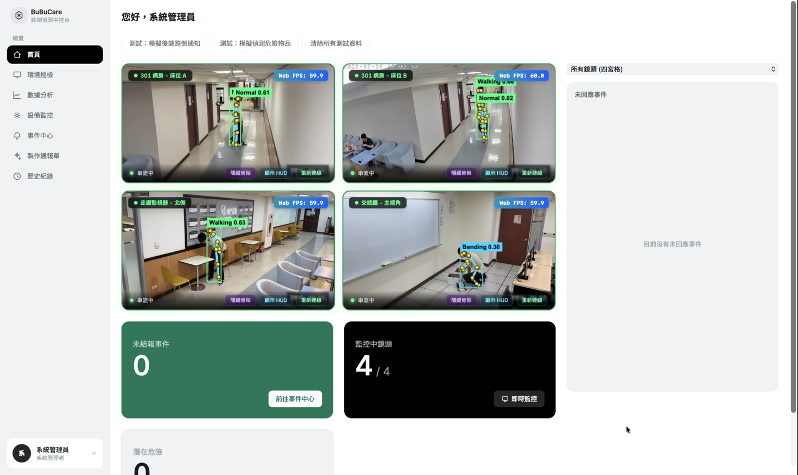

</details>

<details>
<summary><b>通知彈窗</b>　事件送達的第一時間</summary>

<br>

跌倒事件成立時強制彈出，內容是護理人員做決定需要的全部資訊：
事發前後的影片、VLM 產生的語意判讀、AI 信心分數、以及事件已經過多久未處理。
兩個出口對應複判的兩種結果，標記誤報需要二次確認。

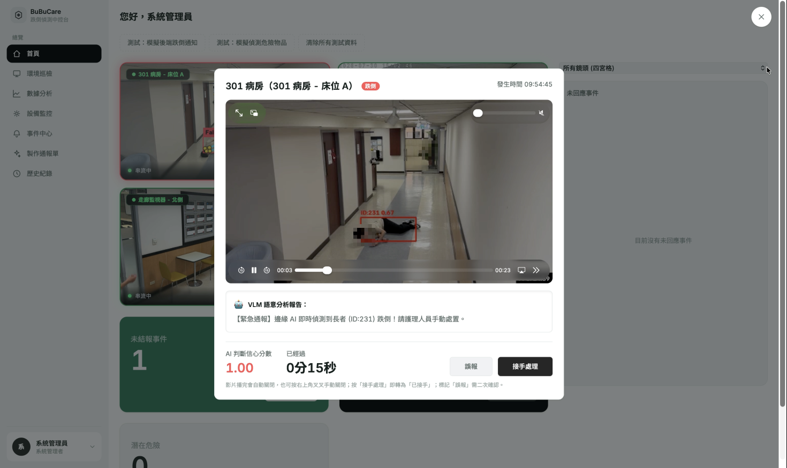

</details>

<details>
<summary><b>環境巡檢</b>　動線阻塞偵測</summary>

<br>

以 RT-DETR 辨識走道上的病床、輪椅與其他環境物品，用途是提早發現動線阻塞。
每格畫面標示串流方式、骨架取樣頻率與時間軸對齊狀態，
右上角顯示邊緣裝置當下的 CPU 與記憶體負載。

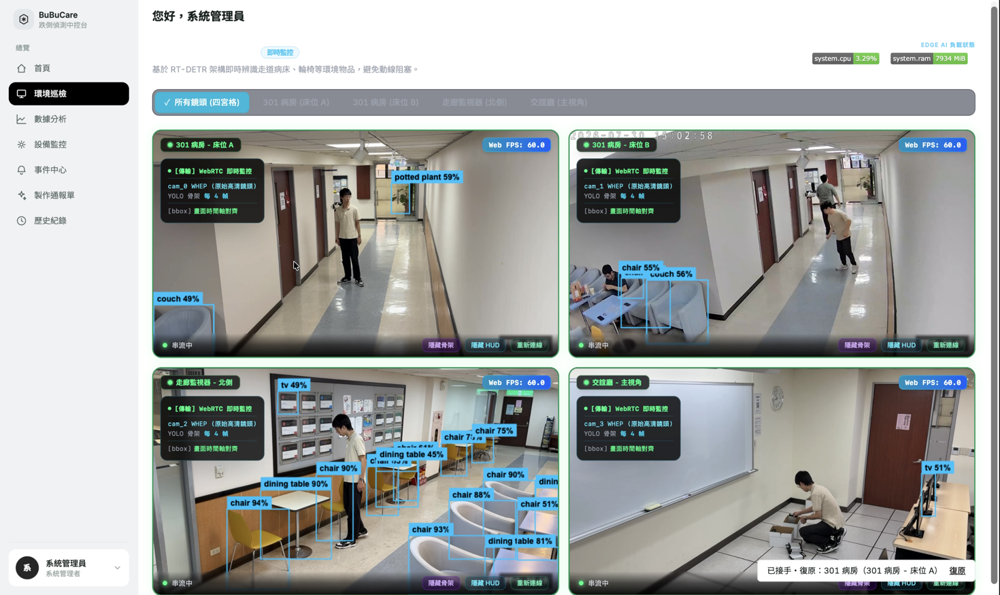

</details>

<details>
<summary><b>事件中心</b>　待處理事件的工作清單</summary>

<br>

以表格呈現事件編號、地點、事發時間、處理時限、續報期限、狀態與處理人。
處理時限與續報期限是長照通報流程的實際要求，直接放在清單上而不是藏在詳情頁。

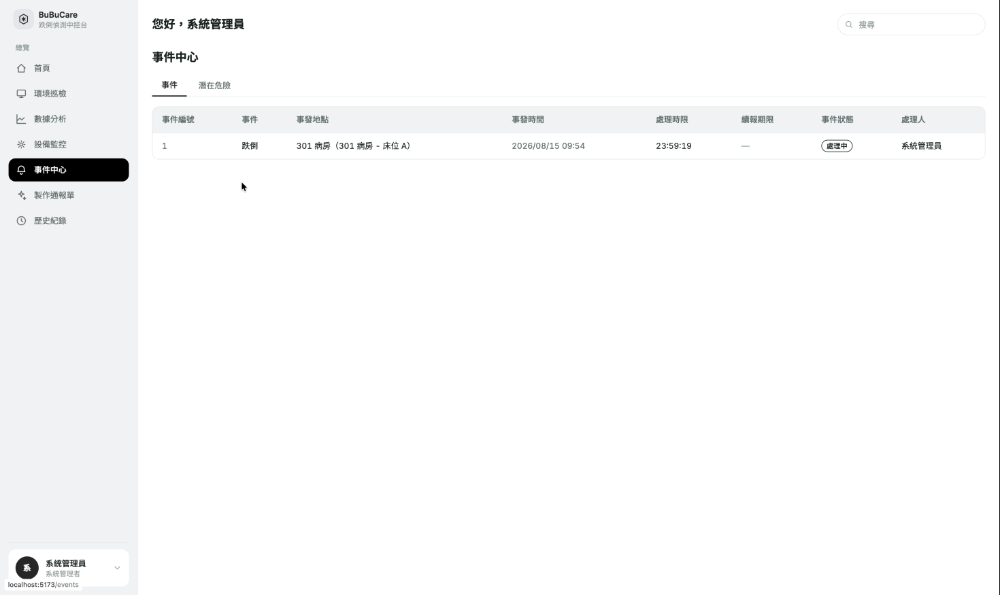

</details>

<details>
<summary><b>事件詳情</b>　複判與通報的入口</summary>

<br>

影片回放搭配完整事件資訊。事件編號採可追溯的格式，
確認之後可直接進入通報單製作流程。

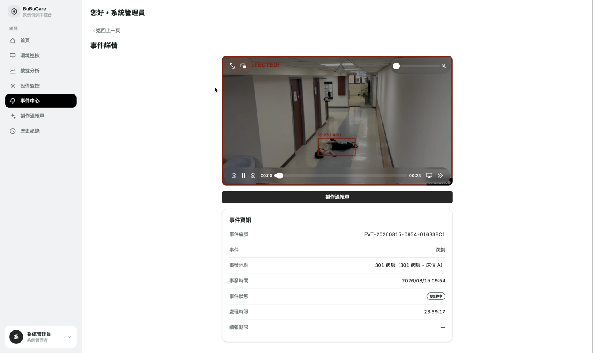

</details>

<details>
<summary><b>設備監控</b>　邊緣裝置的健康狀態</summary>

<br>

Netdata 儀表板直接嵌入中控台，監看邊緣裝置的 CPU、GPU、記憶體與網路。
放進同一個介面的理由是：模型判不出意外與主機資源耗盡，
在護理站看起來完全一樣，都只是「沒有事件」。

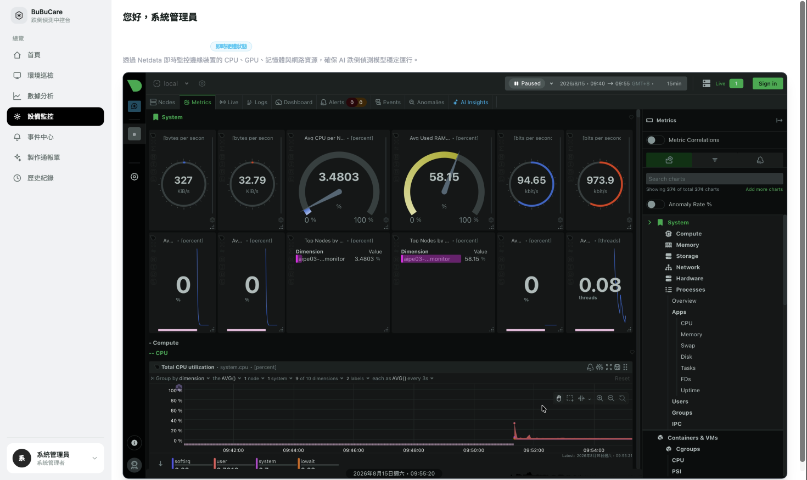

</details>

<details>
<summary><b>數據分析</b>　模型表現與待辦量的兩個數字</summary>

<br>

系統誤報率以日常動作素材（Hard Negatives）測得，用途是確認模型不會把正常起身、
彎腰、坐下判成意外。與它並列的是未結案事件數量，涵蓋初步通報與續報兩個階段。
兩者放在一起的理由是：誤報率反映模型可不可信，未結案數反映流程有沒有卡住，
判斷系統當下的狀態需要同時看這兩面。

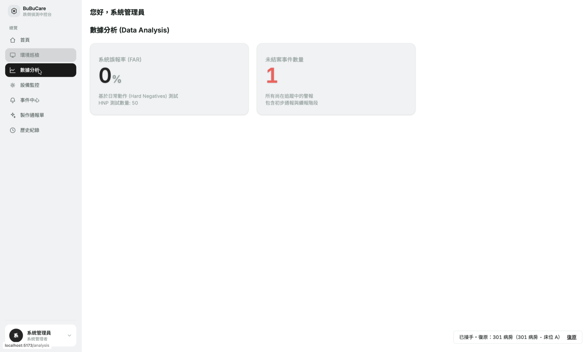

</details>

<details>
<summary><b>製作通報單</b>　初報、續報、結報三階段表單</summary>

<br>

欄位依長照通報的實際格式排列，涵蓋個案基本資料、事發時間、行政區、
發生地點與影響程度。事發時間與地點由事件本身帶入，不需要人工回填，
這是把偵測結果接進既有行政流程的銜接點。

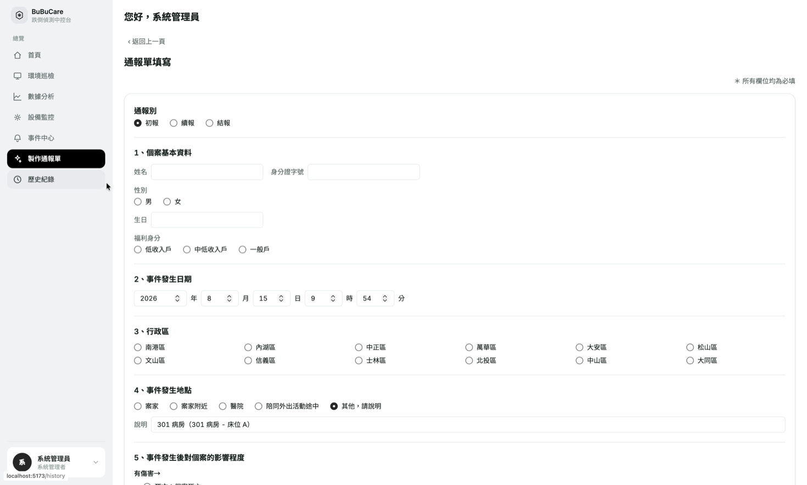

</details>

<details>
<summary><b>歷史紀錄</b>　已結案、誤報與已排除危險的查詢</summary>

<br>

分成已結報事件、誤報紀錄、已排除危險三個分頁。誤報紀錄獨立成一頁是刻意的：
它同時是稽核軌跡與重訓素材的來源，護理人員標記誤報的每一筆，
都會回到第十二節的資料飛輪。

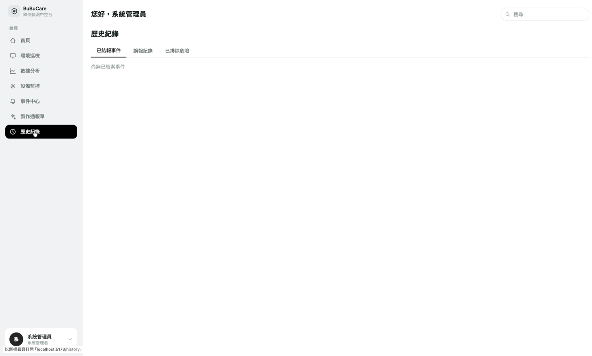

</details>

<details>
<summary><b>使用者管理</b>　帳號與角色</summary>

<br>

角色分為系統管理者與護理站值班人員兩種，僅管理者可進入本頁。
帳號以工號識別，事件的處理人欄位即對應到這裡的帳號，
使每一次複判與通報都能追溯到人。

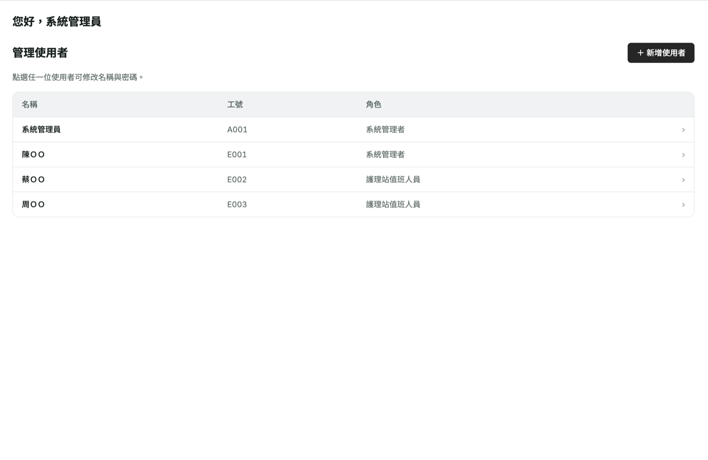

</details>

---

## 3. 系統架構

> **架構圖待補。** 以下文字版資料流為現行實作，圖片補上後保留兩者並存。

```
攝影機 / mp4 檔
      |
      v
  MediaMTX                         影像匯流層，統一收流與分流
      |
      +--- RTSP ---> 邊緣推論層 ai/
      |                  |
      |                  |  Triton 推論：yolo_pose / rt_detr / action_transformer
      |                  |  多道防線判定 + 信心分流
      |                  v
      |            +-----------+
      |            |   Kafka   |
      |            +-----------+
      |             |         |
      |    高信心   |         |   低信心
      |  processed- |         | nursing-home-
      |  reports    |         | alerts
      |             |         v
      |             |    VLM 二審（LangGraph）
      |             |         |
      |             v         v
      |          後端 backend/（FastAPI）
      |                  |
      |                  +--> PostgreSQL（事件與流程狀態）
      |                  +--> S3（影片與快照，簽發限時網址）
      |                  |
      |                  v  SSE 即時推播
      +--- WebRTC --> 前端 frontend/（React）
                         |
                         v
                   人工複判結果
                         |
                         v
        Label Studio -> ClearML -> S3 -> Triton 熱載切版
```

### 3.1 分層職責

| 層       | 目錄                             | 職責                                                   | 部署位置            |
| -------- | -------------------------------- | ------------------------------------------------------ | ------------------- |
| 影像串流 | `streaming/`                   | 收流、分流、觀看驗證                                   | 與攝影機同一內網    |
| 邊緣推論 | `ai/`                          | 模型推論、意外事件判定、事件產出、模型重訓             | 具備 GPU 的邊緣主機 |
| 複審     | `ai/vlm_worker.py`、`agent/` | 低信心事件的第二層判斷                                 | 邊緣主機或獨立主機  |
| 通報     | `backend/`                     | 事件落地、推播、權限、通報流程                         | 雲端 VM 或容器環境  |
| 呈現     | `frontend/`                    | 即時監控、警示、複判、通報單、查詢、環境巡檢、設備監控 | 瀏覽器              |

各層之間**只透過 Kafka 與 HTTP 溝通，沒有任何程式碼層級的相依**。
這讓推論層可以獨立於後端升級、後端可以在推論層不知情的情況下重啟。

---

## 4. 影像串流

### 4.1 解決的問題

影像來源與影像消費端使用的協定完全不同，而且各自無法妥協：

| 端點                    | 需要的協定 | 原因                             |
| ----------------------- | ---------- | -------------------------------- |
| IP 攝影機、手機推流 App | RTSP       | 硬體與 App 的標準輸出協定        |
| 瀏覽器即時監控          | WebRTC     | 瀏覽器唯一能做到低延遲播放的協定 |
| AI 推論程序             | RTSP       | 解碼函式庫的標準輸入             |

若讓每個消費端各自去連攝影機，攝影機的連線數會成為瓶頸，而且每增加一個消費端，就要重新處理一次協定轉換與認證。

### 4.2 本專案的做法

以 **MediaMTX** 作為單一影像匯流層。所有來源推進 MediaMTX，所有消費端從 MediaMTX 取用，協定轉換由它負責。

```
攝影機 (RTSP) ---+
手機 App (RTSP) --+--> MediaMTX --+--> 瀏覽器 (WebRTC)
mp4 測試素材 -----+               +--> AI 推論 (RTSP)
```

三個關鍵設計：

**一、影像完全不經過後端。** 後端只回答「MediaMTX 在哪一台、要看哪個頻道」，以及在有人要看時驗證身分。影像資料流不進後端，因此監控的畫質與路數不會消耗後端資源，後端重啟也不會中斷正在播放的畫面。

**二、觀看需要JWT。** MediaMTX 對每個觀看請求回頭詢問後端，
瀏覽器必須先向後端換取 JWT 才看得到畫面，光有網址無法觀看。
AI 端的 RTSP 讀取則刻意放行，前提是攝影機、MediaMTX、推論主機同屬受控內網。

**三、偵測結果以座標傳遞，不燒進影像。** 早期做法是 AI 端把骨架與偵測框畫進畫面、重新編碼推回另一條串流，前端切換頻道觀看。現行做法改為 AI 端只送座標給後端，瀏覽器用 canvas 將骨架疊在原始影像上。

| 比較項               | 燒進影像               | 座標疊圖                 |
| -------------------- | ---------------------- | ------------------------ |
| AI 端成本            | 每路多一支即時編碼程序 | 每次幾 KB 的座標傳輸     |
| 切換原始與偵測畫面   | 更換串流來源，畫面中斷 | 疊加圖層開關，畫面不中斷 |
| 外部播放器可見偵測框 | 可見                   | 不可見（此為取捨的代價） |

### 4.3 解碼層與平台差異

邊緣端從 MediaMTX 拉 RTSP 並解碼，現行實作使用 PyAV，以低延遲參數（TCP 傳輸、關閉輸入緩衝、解碼器低延遲模式）換取即時性，介面刻意對齊 `cv2.VideoCapture`，讓上層推論邏輯不感知解碼實作。

選擇 PyAV 而非 GStreamer 或 DeepStream，是跨平台開發需求下的取捨：

| 方案       | 優勢                                                    | 不採用的原因                                                |
| ---------- | ------------------------------------------------------- | ----------------------------------------------------------- |
| DeepStream | `nvinferserver` 直接對接 Triton，GPU 端零拷貝與批次化 | 綁 NVIDIA 硬體與 Linux，macOS 開發機無法運行                |
| GStreamer  | 硬體解碼管線成熟                                        | 需 OpenCV 編譯時啟用，且測試素材含 AV1 編碼，既有管線解不開 |
| PyAV       | 跨平台一致，自帶 libdav1d 可解 AV1                      | 犧牲 GPU 端零拷貝效率                                       |

Triton 推論層與解碼層各自獨立，因此在具備 NVIDIA GPU 的正式環境改用 DeepStream 對接 Triton 是可行的演進方向，替換範圍僅限拉流與推論呼叫。

---

## 5. 模型介紹

跌倒偵測的困難不在「認出人在哪裡」，而在區分以下情境。單張影像的姿態資訊無法區分它們：

- 跌倒後躺在地上，與主動躺下休息
- 蹲下綁鞋帶或撿東西，與跌倒的中間過程
- 被沙發或床沿遮擋只露出上半身，與真正的臥倒姿態

因此本系統不依賴單一模型，而是讓三顆模型各自提供不同維度的資訊。

| 模型                   | 任務         | 提供的資訊                     | 執行後端     |
| ---------------------- | ------------ | ------------------------------ | ------------ |
| `yolo_pose`          | 人體姿態估計 | 每個人的 17 個關鍵點座標       | ONNX Runtime |
| `rt_detr`            | 環境物件偵測 | 家具與環境物品的位置與類別     | TensorRT     |
| `action_transformer` | 時序動作分類 | 連續 30 幀骨架序列是否構成跌倒 | ONNX Runtime |

### 5.1 `yolo_pose`：人體骨架

基於 YOLO11-Pose，輸出每個人的 COCO 17 點骨架。所有後續判斷都建立在這組座標上：
肩髖連線的傾角、人體外框的長寬比、關鍵點的可見度，全部由此推導。
它同時也是前端骨架疊圖的資料來源。

### 5.2 `rt_detr`：物件辨識

RT-DETR 是 Transformer 架構的物件偵測模型，在本專案中不用於偵測跌倒，而是回答「這個人身邊有什麼物體」。

它存在的理由是解決**遮擋誤判**。當一個人坐在沙發後方、只露出上半身時，
骨架的長寬比與關鍵點缺失模式和真正的臥倒非常接近。有了家具位置，
系統才能判斷「下半身消失是因為被遮擋」而不是「這個人躺在地上」。

它同時支撐前端的環境巡檢功能：辨識房間內的病床、輪椅與其他障礙物，
也可以結合骨架辨識與動作辨識，開發出偵測不同情境的辨識模組，例如夜間離床、滑落輪椅等。

這顆模型有兩種權重並存：COCO 預訓練版本涵蓋較多日常物品類別，
而經過本專案重訓的版本聚焦在與跌倒判定直接相關的少數類別。
取捨在於推論成本，每一幀都要跑的模型類別越少、輸出越小、延遲越低。

### 5.3 `action_transformer`：動作辨識

自行訓練的 Transformer 動作分類模型，是三顆之中唯一看得到「時間」的。它接收連續 30 幀（約 3 秒）的骨架特徵序列，輸出「跌倒／非跌倒」二分類。

這顆模型解決 yolo_pose 的難題，人的行動變化是有時序的，例如跌倒是一個過程，而不是一個固定姿態，從站立到倒地的速度、軌跡與姿態變化順序，是它與「主動躺下」的區別所在，而這些資訊只存在於時間序列中，單幀影像沒有。

| 項目               | 內容                                                                       |
| ------------------ | -------------------------------------------------------------------------- |
| 輸入               | 30 幀 × 34 維骨架特徵                                                     |
| 輸出               | 2 類（跌倒／非跌倒）機率                                                   |
| 訓練資料           | 公開資料集，並以自有場域錄製的 123 支影片微調                              |
| 驗收方式           | 跨鏡位切分。訓練只用鏡位一（62 支），測試用完全未參與訓練的鏡位二（61 支） |
| 正常影片誤報幀佔比 | 5.7%（微調前 32.7%）                                                       |
| 重複性             | 相同流程重複訓練三次，誤報幀佔比落在 4.7% 至 6.6%                          |

> 完整評估報告與原始輸出待補。

### 5.4 場域微調：從公開資料集到實際場域

以公開資料集訓練的模型，部署到自有場域後表現與測試集成績有明顯落差。
這一段記錄問題如何被定位與解決，也是 [Data Flywheel](#12-data-flywheel)
所描述的迴路在本專案的第一個實際案例。

**問題**：以公開資料集訓練的 Action Transformer 部署到自有場域後，
正常影片中被判為跌倒的畫面佔比達 32.7%。

**先確認不是閾值問題**：調高觸發門檻確實能壓低誤報，但代價不成比例。
把誤報壓到 10% 時，幀級召回率只剩 0.9%，等於模型失去偵測能力。
這排除了「調參就能解決」的可能，指向訓練資料與部署場域之間的分布落差，
具體是攝影機視角與場地條件的差異。

**對策**：在實際場域錄製 123 支影片，逐幀標註跌落區間，用於微調既有模型。

**驗收設計**：採跨鏡位切分。訓練只使用鏡位一的 62 支，
測試使用完全未參與訓練的鏡位二的 61 支。
選擇跨鏡位而非隨機切分，是因為這顆模型的已知弱點正是對視角敏感。
若訓練與測試共用鏡位，成績會高估實際部署時的表現。

**結果**：系統設定與判定邏輯完全不動，僅更換模型版本，
正常影片誤報幀佔比由 32.7% 降至 5.7%，且偵測到的跌倒事件數量未減少。
相同流程重複訓練三次，誤報幀佔比落在 4.7% 至 6.6%，結果穩定。

這個案例說明的不只是一次調校，而是為什麼系統需要資料飛輪：
場域落差無法在部署前預先解決，只能靠現場資料回流持續修正。

### 5.5 判定機制

三顆模型的輸出不是投票，而是分工進入多道判定：

1. **幾何防線**：由骨架推導的體角與長寬比條件，判斷是否為臥倒姿態
2. **遮擋防線**：結合家具位置與參考身高，排除被遮擋造成的假性臥倒
3. **時序分類**：`action_transformer` 對 30 幀視窗給出跌倒信心值
4. **連續幀確認**：需連續多個處理幀都判定倒地才成立，避免瞬時姿態造成誤報
5. **跨幀身分追蹤**：以 ByteTrack 維持每個人的身分，讓判定與冷卻能以「人」為單位

---

## 6. 推論平台

### 6.1 解決的問題

三顆模型分別使用 ONNX Runtime 與 TensorRT 兩種執行後端，若在應用程式內直接載入，會產生四個問題：

| 問題     | 說明                                                         |
| -------- | ------------------------------------------------------------ |
| 相依混雜 | 應用程式必須同時安裝並管理兩套推論框架及其版本相依           |
| 資源浪費 | 每個程序各自載入一份模型權重到 GPU，多路相機時記憶體迅速耗盡 |
| 版本綁定 | 換模型等於改程式碼、重新部署應用程式                         |
| 更新中斷 | 模型更新必須重啟應用程式，服務中斷                           |

### 6.2 本專案的做法

以 **NVIDIA Triton Inference Server** 作為統一推論服務，
應用程式透過 HTTP 或 gRPC 呼叫，本身不載入任何模型。

```
ai/inference_test.py
      |
      | HTTP / gRPC
      v
+---------------------------+
|  Triton Inference Server  |
|                           |
|  yolo_pose (ONNX Runtime) |
|  rt_detr (TensorRT)       |
|  action_transformer (ONNX)|
+---------------------------+
      |
      v
     GPU
```

使用NVIDIA Triton Inference Server 帶來的效果：

- **推論與應用邏輯各自獨立**：換模型、換執行後端、換版本都只改 Triton 的模型倉庫設定，應用程式的呼叫端一行都不動
- **模型共用 GPU**：三顆模型在同一個服務行程內共享顯示卡資源
- **熱載切版**：新模型可以在服務不中斷的情況下上線，這是 Data Flywheel 能夠自動部署的前提
- **跨環境一致**：開發機沒有 GPU 時，只需把模型倉庫換成 CPU 版設定，
  呼叫端程式碼完全相同

### 6.3 版本管理

每顆模型的設定檔一律明確指定版本，不依賴 Triton 的自動載入行為。
是因發生過 Triton 預設載入版本號最大的目錄，而一個無法載入的版本會讓整台推論服務起不來，因此改為明確鎖版把「哪個版本上線」變成一個需要人為決定並記錄的動作。

### 6.4 服務埠

| 協定    | 埠   | 備註                              |
| ------- | ---- | --------------------------------- |
| HTTP    | 8010 | 8000 已被後端佔用，此處刻意錯開   |
| gRPC    | 8011 |                                   |
| Metrics | 8002 | Triton 自身的 Prometheus 指標端點 |

### 6.5 效能

| 環境               | 推論框架                     | 實測 FPS   |
| ------------------ | ---------------------------- | ---------- |
| NVIDIA RTX 5060 Ti | TensorRT + ONNX Runtime，GPU | 10.8       |
| Apple M2 Pro       | ONNX Runtime，CPU            | 2.3 至 2.4 |

完整量測與提速實驗見 [`ai/FPS_NOTES.md`](ai/FPS_NOTES.md)，
Triton 這一層是否值得的成本對照見 [`ai/BENCHMARK_TRITON_VS_LOCAL.md`](ai/BENCHMARK_TRITON_VS_LOCAL.md)。

---

## 7. 低信心複審機制

### 7.1 解決的問題

任何分類模型都會產生一批「信心不高不低」的結果。對這類結果可能的處理方式：(1) 一律當成跌倒送出，但誤報通知可能淹沒護理站，讓系統失去可信度；(2) 一律丟棄，但漏報在長照場域的代價是延誤就醫，甚至是人命。兩種處理方式都不可接受，因此本專案對於低信心事件，運用 VLM 技術設計第二層判斷。

### 7.2 信心分流

事件在邊緣端產出時就依信心值分成兩條路：

| 路徑             | 條件                              | 目的地                       | 行為                                |
| ---------------- | --------------------------------- | ---------------------------- | ----------------------------------- |
| **快速道** | 時序分類信心 >= 0.90 且非遮擋情境 | Kafka`processed-reports`   | 直接落庫並推播，不等任何後續處理    |
| **慢速道** | 其餘全部                          | Kafka`nursing-home-alerts` | 交由 VLM 二審，確認後才進入通報流程 |

### 7.3 VLM 二審

慢速道的事件由**視覺語言模型**接手。它讀取事件當下的快照，用自然語言回答「畫面裡發生了什麼」，產出一段中文判讀說明。

VLM 在此的價值不是取代偵測模型，而是提供偵測模型缺少的**語意理解**：
偵測模型只能輸出座標與機率，無法說明「這個人是在整理床鋪還是跌坐在床邊」。這段判讀最終會顯示在事件詳情頁，成為護理人員複判時的參考依據。

| 項目     | 設定                                                                                           |
| -------- | ---------------------------------------------------------------------------------------------- |
| 推論後端 | Ollama（地端部署）                                                                             |
| 視覺模型 | `qwen2.5vl:7b`（現行程式預設）                                                               |
| 判斷模型 | `qwen2.5:7b`（現行程式預設）                                                                 |
| 選型依據 | 頭對頭 A/B 驗證後由團隊拍板，見[`ai/docs/2026-08-03-vlm-ab.md`](ai/docs/2026-08-03-vlm-ab.md) |

> **後續選型**：以下實測後改選 `qwen3.5:4b`，但**尚未套用至程式碼**，
> 現行執行的仍是上表的版本。

#### 7.3.1 選型實測

以同一張「跪著撿東西」的畫面搭配同一段固定格式 prompt，比較四個候選模型。
挑這個情境是因為它正是誤報的高風險姿態：蹲跪與倒地在骨架特徵上相近，
若 VLM 連這張都描述錯誤，二審就失去把關的意義。

測試環境為 MacBook Air M3、16 GB RAM、Ollama 地端部署。

| 模型                     | 體積             | 實測延遲        | 對原圖查核                                 | 判決           |
| ------------------------ | ---------------- | --------------- | ------------------------------------------ | -------------- |
| `gemma4:12b`           | 7.6 GB           | 1 分 11 秒      | 姿態誤判，把「跪」描述為「蹲」             | 不使用         |
| `qwen3.5:9b`           | 6.6 GB           | 40 秒           | 補了圖上沒有的「單手撐地、一腳向前」       | 不使用         |
| `qwen3-VL:8b`          | 6.1 GB           | 1 分 50 秒      | 「身體貼著地面」與畫面不符，方向偏向誤報   | 不使用         |
| **`qwen3.5:4b`** | **3.4 GB** | **38 秒** | 姿態、衣著、與地面關係、四周物品敘述皆吻合 | **採用** |

決定性的因素不是延遲也不是體積，而是**幻覺**。
兩個被排除的模型都補上了畫面中不存在的細節，而二審的產出會直接顯示給
護理人員當作判斷依據，描述錯誤比描述得慢更危險。
最終採用的 `qwen3.5:4b` 同時也是體積最小、延遲最低的一個。

選擇地端部署而非雲端 API 的理由有兩個：影像屬於被照顧者的個人隱私資料，不外傳第三方服務；以及二審是持續運作的常駐流程，雲端 API 的累積成本不可控。

VLM 呼叫被封裝在獨立的介面層，更換推論後端不影響呼叫端。

### 7.4 LangGraph 決策流程

二審不是「呼叫一次 VLM 就結束」，它包含條件判斷、失敗重試、以及在結果模糊時追問。
本專案以 **LangGraph** 將這段流程建構成明確的狀態機。

現行正式服務的二審流程由 `ai/uncertainty_router.py` 承載，
負責決定「何時找 VLM、帶什麼提示詞、灰區如何分流」。

另有一套完整的 LangGraph 實作在 [`agent/`](agent/)，包含 6 個節點：

| 節點            | 型態     | 職責                                                  |
| --------------- | -------- | ----------------------------------------------------- |
| `ingest`      | 純函式   | 解析訊息、定位快照圖檔，壞資料進入死信記錄            |
| `vlm_analyze` | 工具節點 | 呼叫 VLM 產生判讀，失敗時重試                         |
| `judge`       | LLM 節點 | 綜合偵測信心與 VLM 判讀，輸出結構化的判定、信心與理由 |
| `followup`    | 純函式   | 判定結果模糊時組出追問，回頭再問一次 VLM              |
| `env_report`  | 工具節點 | 環境巡檢類事件的報告整理，不做真假判定                |
| `publish`     | 純函式   | 組裝契約格式並送進 Kafka                              |

三個貫穿全圖的設計原則：

**一、LLM 節點只做判斷，副作用集中在純函式節點。**
Kafka 傳送與檔案寫入全部發生在純函式節點，LLM 節點只回答問題。
好處是分支邏輯可以單元測試，不必啟動整張圖與真實模型。

**二、安全非對稱。** 判定為真跌倒時可以自動確認並升級通報；
判定為誤報時只寫入建議欄位，必須經過人工確認才能關閉事件。
系統在任何情況下都不得自動把事件關成誤報。

**三、慢節點不擋告警路徑。** 對告警本身非必要的 LLM 呼叫一律排在發送之後或移出流程。
通報單草稿就是這個原則的實例：它只在真跌倒時需要，改由前端開啟表單時即時產生，
不放在 Kafka 路徑上，避免跌倒通知等待草稿生成。

### 7.5 兩套併行與切換策略

`agent/` 目前運行於 **shadow 模式**：與正式的 `vlm_worker.py` 使用不同的 Kafka
消費者群組，各自獨立消費同一個 topic，但 `agent/` 的判定結果只寫入本地記錄檔、
不送進 Kafka。

這讓新舊兩套實作可以在真實流量下並行比對，切換策略是 shadow、比對、正式切換三步，
回滾只需反向操作。正式切換的通過門檻尚未拍板。

---

## 8. 事件匯流

### 8.1 解決的問題

推論層與通報層在部署上是兩個完全不同的東西：

| 差異點   | 邊緣推論層             | 通報後端           |
| -------- | ---------------------- | ------------------ |
| 部署位置 | 機構內具備 GPU 的主機  | 雲端 VM            |
| 生命週期 | 長時間常駐，重啟成本高 | 隨版本更新頻繁重啟 |
| 擴充方式 | 依攝影機數量增加       | 依使用者數量增加   |

若讓推論層直接呼叫後端 API，兩者的可用性就被綁在一起：
後端部署更新的那 30 秒內產生的意外事件會直接遺失，而這正是最不能遺失的資料。

### 8.2 本專案的做法

以 **Apache Kafka** 作為兩層之間的訊息骨幹。推論層只負責把事件寫進 Kafka，
後端在自己方便的時候讀取。

Kafka 在此帶來四個具體性質：

**一、兩邊互不牽連。** 後端重啟或短暫失效期間，事件累積在 Kafka 中，
後端恢復後從上次的位置繼續讀取，事件不遺失。

**二、分流的實體化。** 前述的快慢分流不是程式碼裡的 if 判斷，
而是兩個實體 topic。這讓分流可以被獨立觀察、獨立消費、獨立重放。

| Topic                   | 承載                           | 消費者                 |
| ----------------------- | ------------------------------ | ---------------------- |
| `processed-reports`   | 已確認的事件，直接進入通報流程 | 後端 consumer          |
| `nursing-home-alerts` | 待二審的低信心事件與環境巡檢   | VLM 二審、shadow agent |

**三、多消費者互不干擾。** 每個消費者使用獨立的群組，各自維護讀取進度。
這是 shadow 模式能夠成立的基礎：新舊兩套二審讀同一個 topic 卻互不影響。

**四、可觀察。** 訊息本身持久保存，可以直接檢視實際流過的內容，
比閱讀程式碼或格式定義更能確認問題所在。開發環境隨附 Kafka UI 提供瀏覽介面。

### 8.3 契約邊界

Kafka 訊息的欄位定義是跨團隊的**契約**，因此被列為專案的硬規則之一，
並由自動化檢查在提交與 CI 兩個階段強制。

這條規則來自一次實際事故：曾有數個偵測模組各自組裝訊息直接送出，
欄位與後端的驗證格式不符，導致每一則事件都被後端靜默退件。
現行規則是偵測模組只回傳判定訊號，訊息的組裝與外送統一由主流程負責。

---

## 9. 後端設計

### 9.1 職責定位

後端是**通報層**，不做任何影像處理與模型推論。它的職責是把 AI 產出的事件
轉成護理人員可以操作的工作流程。

| 職責       | 說明                                         |
| ---------- | -------------------------------------------- |
| 事件落地   | 消費 Kafka 訊息，寫入資料庫                  |
| 即時推播   | 以 SSE 將新事件與狀態變更推送到所有前端      |
| 身分與分權 | JWT 驗證，管理員與一般照護員兩種角色         |
| 複判流程   | 判定（真跌倒／誤報）、處理中、結案的狀態流轉 |
| 通報單     | 初報、續報、結報三階段表單的儲存與查詢       |
| 影像網址   | 為私有儲存的影片與快照簽發限時觀看網址       |
| 串流票證   | 為前端簽發短效權杖，並供 MediaMTX 驗票       |

### 9.2 選擇 FastAPI 的理由

| FastAPI 的特性              | 在本專案的作用                                                                         |
| --------------------------- | -------------------------------------------------------------------------------------- |
| **專注 API 開發**     | 框架本身不綁 ORM 與樣板引擎。後端只做通報層的 API，前端是獨立的 React 應用，用不到那些 |
| **自動資料驗證**      | AI 端送來的事件先經 Pydantic 驗證，欄位不符直接回 422，壞資料進不了業務邏輯與資料庫    |
| **自動產生 API 文件** | AI 端、前端、後端三方以互動式文件為介面的單一依據，不必額外維護一份會過期的說明        |
| **支援 Async 非同步** | SSE 長連線推播事件時不佔用執行緒，多個前端同時連線也不會把後端塞住                     |

### 9.3 結構設計

程式碼採 **feature-based** 分層，一個資料夾等於一個完整功能：

```
backend/
  core/            跨功能共用：設定、資料庫連線、模型定義、驗證、S3
  users/           帳號與權限
  events/          事件、SSE 推播、複判流程
  reports/         通報單
  devices/         鏡頭清單
  streams/         串流權杖與驗票
  observability/   健康檢查與指標輸出
  kafka_consumer.py  獨立行程：消費 Kafka
```

新增功能是新增一個資料夾，而不是修改多個既有檔案。

### 9.4 Kafka consumer 是獨立行程

事件消費刻意做成獨立行程，讀取 Kafka 後**呼叫後端自己的 HTTP 端點**，
而不是直接呼叫內部函式。

理由是 SSE 連線池屬於處理 HTTP 請求的那個行程。獨立行程若直接呼叫內部函式，事件會廣播到自己的空連線池，資料庫寫入成功但前端收不到任何推播，而且不會有任何錯誤訊息。走 HTTP 端點是唯一能保證推播正確送出的方式。

---

## 10. 資料庫設計

系統的資料天然分成兩類，性質差異大到不應該放在同一種儲存中。

| 資料類型                 | 特性                                       | 選用儲存   |
| ------------------------ | ------------------------------------------ | ---------- |
| 事件記錄、帳號、流程狀態 | 結構化、需要交易保證、需要關聯查詢與統計   | PostgreSQL |
| 影片片段、事件快照       | 二進位大檔、一次寫入多次讀取、不需查詢內容 | AWS S3     |

### 10.1 關聯式資料庫：PostgreSQL

部署於 **AWS RDS**，連線啟用 SSL 憑證驗證。

| 資料表                   | 內容                                           |
| ------------------------ | ---------------------------------------------- |
| `user_account`         | 帳號，以員工編號登入，含角色與啟用狀態         |
| `companies`            | 機構                                           |
| `locations`            | 位置與樓層                                     |
| `devices`              | 鏡頭，含對應的串流頻道名稱                     |
| `staff`                | 照護員                                         |
| `detect_events`        | 偵測事件本體，含判定、處理狀態、影片與快照位置 |
| `detect_event_reports` | 通報單，一筆事件可有多筆，累積不覆蓋           |

**一、鏡頭表存頻道名稱而非完整網址**

主機位址放在環境變數中，換場地、換機器、換網路只需修改一個設定值，不必更新資料庫內容。

**二、通報單累積不覆蓋**

初報、續報、結報各存一筆新記錄。通報記錄屬於照護流程的軌跡，任何一次覆寫都會讓事後追溯失去意義。

**三、操作者由後端從權杖填入**

判定者與結案者的員工編號由後端從 JWT 取得，前端無法指定。誰按的按鈕由誰負責，這一點不能交給前端宣稱。軟刪除用於帳號停用，停用的帳號無法登入，但其歷史操作記錄的關聯完整保留。

### 10.2 物件儲存：AWS S3

事件影片與快照存放於 S3，資料庫只儲存 `s3://bucket/key` 形式的位置字串。

**Bucket 保持私有，不開放公開讀取。** 前端需要播放影片時向後端請求，後端簽發一組帶簽章的限時網址，超過存續時間即失效。影像屬於被照顧者的個人隱私資料，任何形式的長期公開連結都不可接受。

### 10.3 兩組金鑰的權限分離

S3 的存取刻意使用兩組不同權限的金鑰：

| 使用者     | 權限 | 用途               |
| ---------- | ---- | ------------------ |
| 邊緣推論層 | 讀寫 | 上傳事件影片與快照 |
| 後端       | 唯讀 | 簽發限時觀看網址   |

後端是對外開放的服務，攻擊面遠大於內網的推論主機。即使後端被入侵，攻擊者拿到的金鑰也無法寫入或刪除任何既有的影像證據。這是最小權限原則的直接應用，兩組金鑰不可混用。

---

## 11. 系統監控與營運

長照系統的失效包含攝影機斷線、推論服務降級、事件消費停止，畫面上都不會有任何錯誤訊息，只是不再有事件產生。而「沒有事件」與「沒有人發生意外」在外觀上完全相同。因此監控的目的不只是效能觀察，而是確保這套系統現在真的還在工作。

### 11.1 應用層：Prometheus

後端提供兩個服務層級端點，不屬於任何業務功能：

| 端點             | 用途                                                         |
| ---------------- | ------------------------------------------------------------ |
| `GET /health`  | 存活探針。不查資料庫，回應越快越好，供部署腳本與反向代理使用 |
| `GET /metrics` | Prometheus 指標輸出，純文字格式                              |

Prometheus 定期抓取 `/metrics`，把當下數值存成時間序列，用於趨勢觀察與告警。

推論層的 Triton 也自帶 Prometheus 指標端點（8002 埠），提供推論次數、佇列延遲、GPU 使用率等資料。

| 指標來源         | 目前提供                                       |
| ---------------- | ---------------------------------------------- |
| 後端`/metrics` | 人工判定次數（依判定結果分類）                 |
| Triton 8002      | 推論請求數、延遲、GPU 使用率等 Triton 內建指標 |
| 業務指標擴充     | 待補                                           |

後端目前的業務指標僅有人工判定次數一項。事件產出率、二審延遲、Kafka 消費落後量等關鍵營運指標尚未納入。

### 11.2 機器層：Netdata、Grafana 與 exporters

應用層指標無法回答「主機本身是否健康」。推論主機的 GPU 記憶體耗盡、
磁碟寫滿導致影片存不進去、網路壅塞造成串流掉幀，這些都不會出現在業務指標裡，但每一項都足以讓系統停止產生事件。

| 元件                | 監控對象                                      |
| ------------------- | --------------------------------------------- |
| Netdata             | 主機 CPU、GPU、記憶體、磁碟、網路，秒級解析度 |
| PostgreSQL exporter | 資料庫連線數、查詢效能、鎖等待                |
| JMX exporter        | Kafka broker 的 JVM 與 topic 層級指標         |
| Grafana             | 統一儀表板                                    |

選用 Netdata 的理由是它開箱即用，安裝後自動發現主機上的服務並開始收集，不需要為每一項指標撰寫設定。對規模有限的專案而言，這比自建完整的指標定義體系更務實。

機器層監控被直接嵌入中控台的「設備監控」頁，而不是要求使用者另外開一個維運工具。同時「環境巡檢」頁的右上角常駐顯示邊緣裝置的 CPU 與記憶體負載。

---

## 12. Data Flywheel

### 12.1 為什麼需要 Data Flywheel？

意外事件偵測模型有一個無法迴避的性質，即「在測試資料集上的表現，無法代表實際部署後的表現」。攝影機的架設高度與角度、家具擺設、地板顏色、被照顧者的行為模式，每一個機構都不一樣，而這些差異足以讓訓練時表現良好的模型在現場失準。

這不是找更好的資料集能解決的問題，因為問題出在部署環境與訓練環境的分布差異。唯一的解法是讓模型持續學習現場實際拍到的畫面。

同時，現場資料有一個實驗室資料集沒有的優勢，就是每一筆事件都已經被護理人員複判過，標註來自實際使用，不需要額外投入標註人力。而 Data Flywheel 就是把這個優勢制度化，使用系統的行為本身產生訓練資料，模型因此變準，變準的模型讓使用者更願意使用，形成正向循環。

### 12.2 迴路組成

```
現場事件快照
     |
     v
Label Studio            AI 預標註，人工審核修正後送出
     |
     v
資料集準備              清洗標註、切分訓練與驗證集
     |
     v
ClearML 佇列            任務排隊，訓練節點依序取用
     |
     v
訓練與評估              計算 mAP，與品質門檻比較
     |
     +--- 未達門檻 ---> 上傳並標記為未通過，不會被部署
     |
     +--- 達到門檻 ---> 上傳 S3 並標記為最佳
                              |
                              v
                     Triton 熱載切版，服務不中斷
```

### 12.3 Label Studio：把複判變成標註

Label Studio 承擔「人工知識進入系統」的入口。它的關鍵作用是 **AI 預標註**：現有模型先對圖片產生一組標註，人工只需要修正錯誤的部分，而不是從零開始框選。這讓標註成本降到可以在日常工作中負擔的程度。

本專案有兩條標註線，共用同一批圖片：

| 線     | 標註內容             | 訓練目標      |
| ------ | -------------------- | ------------- |
| 偵測線 | 物件框               | `rt_detr`   |
| 骨架線 | 物件框加 17 個關鍵點 | `yolo_pose` |

兩條線分開的理由是格式不相容：偵測模型看不懂關鍵點，而姿態模型缺少關鍵點就無法訓練。兩條線的標註刻意存放在不同目錄，避免同一張圖被兩邊寫入時互相覆蓋。

### 12.4 ClearML：讓重訓可重現且可排隊

ClearML 負責訓練任務的排隊、執行與記錄。它解決三個問題：

**一、資源排隊**

訓練需要獨佔 GPU，而 GPU 同時也在跑即時推論。任務進入佇列由訓練節點依序取用，不會與推論搶資源。

**二、可重現**

每次訓練的參數、資料集版本、程式碼版本、評估結果都被完整記錄。半年後回答「這顆線上模型是用什麼資料訓出來的」不需要靠記憶或翻找。

**三、可比較**

多次實驗的指標並列呈現，模型是變好還是變差有客觀依據，而不是靠感覺。

### 12.5 品質門檻：飛輪的安全閥

自動化迴路最大的風險是**自動讓模型變差**。若每次重訓的結果都自動上線，一次資料品質不佳的重訓就會讓線上模型退步，而且全程不會有任何錯誤訊息。因此迴路中設有品質門檻：

- 訓練完成後計算 mAP，與門檻值比較
- **未達門檻的權重照樣上傳並保留**，但標記為未通過
- 部署程序只抓取「最新的通過標記」，因此未達標的模型不會上線

門檻擋的是「上線資格」而不是「上傳」。保留未通過的權重是為了事後分析，判斷是資料問題還是訓練參數問題。

### 12.6 熱載切版與回滾

通過門檻的權重會被轉換成 Triton 需要的格式並切換版本，服務不中斷。
部署程序支援回滾，新版本表現不如預期時可以退回上一版。

---

---

## 授權

本專案採 [MIT License](LICENSE)。
