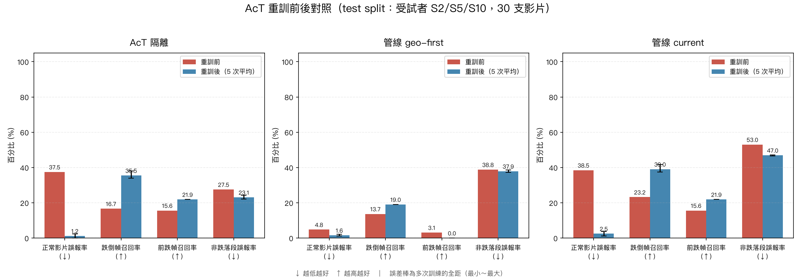
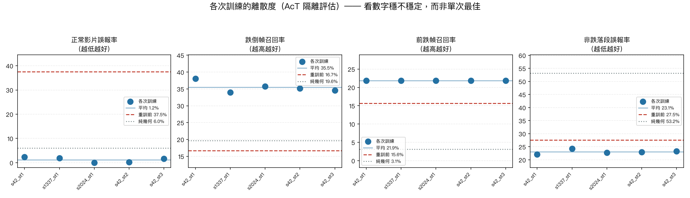
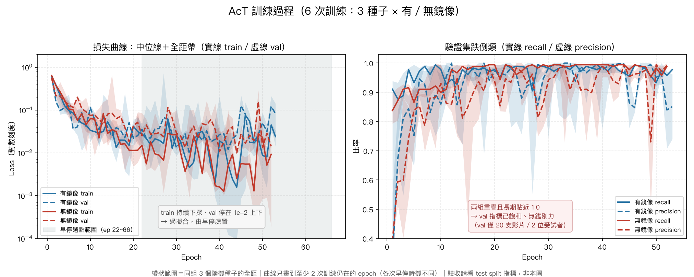
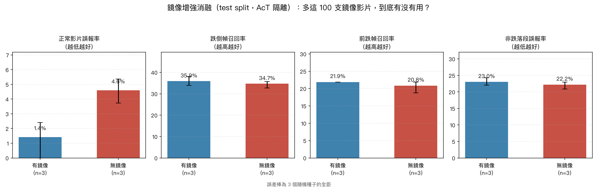
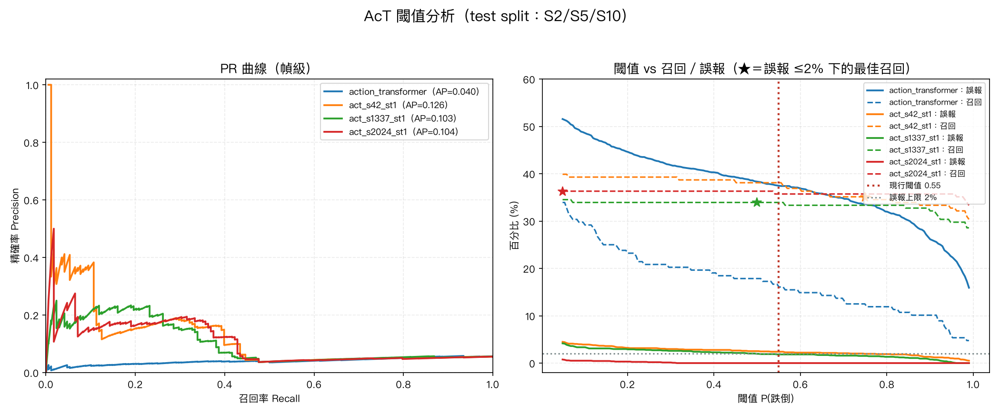

# AcT 重訓成果：誤報降 30 倍，前跌從幾何盲區裡撈回來

日期：2026-07-29
影響檔案：新增 `ai/train/`（工具鏈與資料集），**尚未動正式管線**
前置文件：[2026-07-29-act-retrain-plan.md](2026-07-29-act-retrain-plan.md)（重訓計畫）、
[2026-07-29-pipeline-false-alarm-fix.md](2026-07-29-pipeline-false-alarm-fix.md)（上一輪的參數修正）

---

## TL;DR

在 AcT 隔離評估下（test split：受試者 S2/S5/S10，30 支影片）：

| | 重訓前 | 重訓後（5 次平均） | 純幾何基準 |
|---|---:|---:|---:|
| 正常影片誤報率 | 37.5% | **1.2%** | 6.0% |
| 跌倒幀召回率 | 16.7% | **35.5%** | 19.6% |
| 前跌幀召回率 | 15.6% | **21.9%** | 3.1% |
| 平均觸發延遲 | 1.66s | **1.09s** | — |

**最重要的結論：上一輪被迫關掉的 `ACT_ALONE_CAN_TRIGGER` 可以打開了。**
該模式下誤報率從 38.5% 降到 **2.5%**，通過 5% 的及格線。

跨 3 個隨機種子與 3 種 stride 共 5 次訓練，結果高度一致——**這不是抽到好籤。**

另外三項補充實驗：

| 實驗 | 結論 |
|---|---|
| **鏡像增強消融**（3 種子 × 有無鏡像） | 有效，但**只作用在誤報**：4.6% → 1.4%（降 70%），召回幾乎不動 |
| **閾值分析**（PR 曲線） | 現行 0.55 已接近最佳，不需改；**舊模型的誤報曲線整條都在 2% 上限之上**，無論怎麼調都不可用 |
| **訓練曲線** | 有明確過擬合（train/val 差兩個數量級），成因是獨立跌倒事件只有 25 次，由早停處置 |

---

## 為什麼要重訓

上一輪（[pipeline-false-alarm-fix](2026-07-29-pipeline-false-alarm-fix.md)）用兩個常數把誤報從
44.7% 壓到 2.0%，但付出兩個代價：

1. **AcT 被降權成「只能附議、不能提案」**（`ACT_ALONE_CAN_TRIGGER=false`）。
   因為當時「幾何正常但 AcT 說跌倒」這條路徑貢獻了 78.7% 的誤報。
2. **往前跌完全抓不到**。俯視/斜上視角下前跌的幾何特徵接近於零，調參數解決不了。

這兩件事只有一個共同解法：讓 AcT 真的變準。

---

## 做了什麼

### 資料

| | |
|---|---|
| 素材 | CAUCAFall 100 支（10 受試者 × 10 動作，720×480 / 20fps）＋水平鏡像 100 支 |
| 切分 | train `S1,3,4,6,7`＋鏡像（100 支）／val `S8,9`（20）／test `S2,5,10`（30）|
| 鏡像規則 | `S<n+10>` 是 `S<n>` 的鏡像＝**同一個人**，必須同組。val/test 不做增強 |
| 標註 | **50 份人工幀級標註**，逐支標出跌落起訖幀 |

test 選 `S2/S5/S10` 是因為原本 `ai/test_demo/` 的基準影片全落在這三位，含全部 4 支跌倒基準。

### 標註為什麼不能省

不能用「整片一個標籤」。一支跌倒影片裡前段站著、中段跌落、後段躺著（CAUCAFall 的受試者
多半還會爬起來），全標成跌倒會讓模型學成「**躺著＝跌倒**」——那正是現行誤報的根源。

過程中量化證實了前跌盲區：**幾何規則猜不出跌落點的 9 支影片中，6 支是前跌**
（10 支前跌中的 6 支）。這些只能靠人眼標。

### 訓練

架構完全不動（71,330 參數，與 `inference_test.py:309` 逐字一致），只換資料。

```
epochs 100（早停 patience 20）｜batch 64｜lr 1e-3｜Adam
class weight 跌倒 2.92 / 正常 0.60（跌倒是少數類，不加權會學成「一律說正常」）
min-valid-ratio 0.5（丟棄 pose 偵測率不足一半的視窗）
訓練視窗 5517（跌倒 946 / 正常 4571），裝置 MPS，單次約 1~2 分鐘
```

---

## 成果

### 重訓前後對照



三種策略的完整數字：

| 策略 | 指標 | 重訓前 | 重訓後 | 抓到的跌倒影片 |
|---|---|---:|---:|---|
| **AcT 隔離** | 正常誤報 | 37.5% | **1.2%** | 5/15 → 8.4/15 |
| | 跌倒召回 | 16.7% | **35.5%** | |
| | 前跌召回 | 15.6% | **21.9%** | |
| **管線 current**<br>（AcT 可單獨觸發）| 正常誤報 | 38.5% | **2.5%** | 10/15 → 11.4/15 |
| | 跌倒召回 | 23.2% | **39.0%** | |
| | 前跌召回 | 15.6% | **21.9%** | |
| **管線 geo-first**<br>（現行設定）| 正常誤報 | 4.8% | 1.6% | 10/15 → 10/15 |
| | 跌倒召回 | 13.7% | 19.0% | |
| | 前跌召回 | 3.1% | **0.0%** ⚠ | |

### 穩定性：5 次訓練幾乎重疊



| 實驗 | 訓練視窗 | 跌倒召回 | 正常誤報 |
|---|---:|---:|---:|
| seed 42, stride 1 | 5517 | 38.1% | 2.4% |
| seed 1337, stride 1 | 5517 | 33.9% | 1.8% |
| seed 2024, stride 1 | 5517 | 35.7% | 0.0% |
| seed 42, stride 2 | 2777 | 35.1% | 0.3% |
| seed 42, stride 3 | 1876 | 34.5% | 1.6% |

**stride 從 1 加到 3、樣本砍到三分之一，表現幾乎不變。**
代表瓶頸不在「滑動視窗製造的重複樣本」，而在**獨立跌倒事件只有 25 次**——
那是資料量的天花板，調參解決不了。

---

---

## 訓練過程



6 次訓練（3 個隨機種子 × 有／無鏡像），逐輪歷史記錄於 `<權重>.run.json` 的 `history` 欄位。

### 有明確的過擬合，這裡誠實交代

**train loss 掉到 `1e-4`，val loss 停在 `1e-2`，差約兩個數量級。**

成因很清楚：訓練集有 5517 個視窗，但那是滑動視窗製造的數字——
**真正的獨立跌倒事件只有 25 次**（5 位受試者 × 5 種跌法），鏡像只是同一事件的另一個視角。
71,330 個參數配 25 個獨立正樣本，過擬合是必然。

處置方式是早停（patience 20），取 val loss 最低那一輪的權重，圖上以 ★ 標示。
最佳輪落在 epoch 22~66 之間，都遠早於 train loss 觸底的位置。

**這是資料量的天花板，不是超參數沒調好**——[stride 消融](#穩定性5-次訓練幾乎重疊)已經證實：
樣本砍到三分之一，表現幾乎不變。要突破只能增加獨立事件數，也就是自錄。

### 可重現性

相同參數（seed 42、stride 1）的兩次獨立訓練，test 指標**完全一致**
（跌倒召回 38.1%、誤報 2.4%、前跌 21.9%）。隨機性已由 `--seed` 完全控制。

---

## 消融實驗：那 100 支鏡像影片到底有沒有用



做鏡像增強花了不少工——處理 COCO 關鍵點的左右語意、避開 `xyn` 的 0 哨兵值、
設計 `S<n+10>` 的防洩漏規則。但**沒驗證過它有沒有貢獻**，所以補了這組對照：
同樣 3 個種子，訓練集排除全部鏡像檔（`--exclude-flipped`），其餘設定完全相同。

| | 訓練視窗 | 正常誤報 | 跌倒召回 | 前跌召回 | 非跌落段誤報 |
|---|---:|---:|---:|---:|---:|
| **有鏡像** | 5517 | **1.4%**（0.0~2.4）| 35.9% | 21.9% | 23.0% |
| **無鏡像** | 2814 | **4.6%**（3.7~5.4）| 34.7% | 20.8% | 22.2% |

### 結論：有用，但作用是專一的

**鏡像增強改善的是誤報，不是召回。** 誤報降 70%（4.6% → 1.4%），
而召回只動了 1.2 個百分點、前跌只動 1.1 個。

誤報那一欄的**誤差棒完全不重疊**（有鏡像 0.0~2.4%、無鏡像 3.7~5.4%），
差異不是隨機波動；其餘三欄則明顯重疊。

這與當初做增強時的預期一致：水平翻轉的價值是**逼模型不能依賴「人在畫面哪一側」**
這個訊號——那正是 [重訓計畫 3.3 節](2026-07-29-act-retrain-plan.md) 懷疑的根因
（特徵用 `keypoints.xyn`，是對整張影像歸一化的絕對座標）。
不依賴左右位置 → 正常動作不再因為人走到某側而被誤判 → 誤報下降。

它不會憑空增加獨立跌倒事件，所以召回率幾乎不動；也救不了前跌，
因為前跌是前後方向的運動，鏡像後還是前跌。

---

## 閾值分析：0.55 這個門檻該不該改



正式管線的 `DIRECT_TRIGGER_CONF = 0.55` 是**為舊模型挑的**，重訓後從沒重選過。
掃描整條曲線，在「正常影片誤報率 ≤ 2%」的約束下找最佳召回：

| 模型 | AP | 閾值 0.55 的表現 | 重選後 |
|---|---:|---|---|
| 舊模型 | **0.040** | 召回 16.1%／誤報 37.5% | **無解**——任何閾值都達不到 2% |
| 新模型 seed 42 | 0.126 | 召回 38.1%／誤報 2.4% | 0.75：召回 35.1%（−3.0%）|
| 新模型 seed 1337 | 0.103 | 召回 33.9%／誤報 1.8% | 0.50：與現行相同 |
| 新模型 seed 2024 | 0.104 | 召回 35.7%／誤報 0.0% | 0.05：召回 36.3%（+0.6%）|

### 兩個結論

**1. 閾值不用改。** 三個種子重選後分別是 −3.0%、0、+0.6%，沒有可撿的收益。
現行的 0.55 已經落在合理位置。

**2. 更重要的是舊模型那一列。** 它的誤報曲線**整條都在 2% 上限之上**（從 51% 到 15%），
意思是無論怎麼調閾值都達不到可用水準。

這回答了一個必然會被問的問題：*「你確定當初不是閾值沒調好，而是模型不行？」*
——確定。舊模型沒有任何可用的操作點，關掉 `ACT_ALONE_CAN_TRIGGER` 是唯一選擇。

> AP 絕對值偏低（0.126）是因為召回天生受視窗機制壓抑（見下方「哪些數字不能信」）。
> 這裡看的是**相對倍數**：新模型是舊模型的 2.6~3.2 倍。

---

## 五個結論

### 1. `ACT_ALONE_CAN_TRIGGER` 可以打開

舊模型在該模式下誤報 38.5%（所以被關掉），新模型 2.5%，通過 5% 及格線。
這是本次重訓的主要目標，達成。

### 2. `geo-first` 該退場

它的前跌召回是 **0.0%**，比純幾何的 3.1% 還差。
原因：新 AcT 更保守（誤報低），而 geo-first 要求幾何先成立才讓 AcT 附議——
前跌的幾何特徵接近於零，這個模式結構上就救不了前跌。繼續用它等於浪費重訓成果。

### 3. AcT 這次真的有貢獻

對照 `geometry_only`（AcT 完全停用）：

| | 跌倒召回 | 前跌召回 | 正常誤報 |
|---|---:|---:|---:|
| 純幾何 | 19.6% | 3.1% | 6.0% |
| 舊 AcT | 16.7% | 15.6% | 37.5% |
| **新 AcT** | **35.5%** | **21.9%** | **1.2%** |

舊模型在召回上甚至輸給純幾何、誤報還高 6 倍，等於沒有貢獻。新模型全面超越。

### 4. 鏡像增強有效，但只作用在誤報

誤報降 70%（4.6% → 1.4%，誤差棒不重疊），召回與前跌幾乎不動。
機制是「逼模型不依賴人在畫面的左右位置」，與事前假設一致。詳見上方消融實驗。

### 5. 現行閾值 0.55 不需更動，而舊模型無論怎麼調都不可用

新模型在 0.55 已接近最佳操作點；舊模型的誤報曲線整條都在 2% 上限之上。
這證明當初的降權處置是模型本質問題，不是調參不足。

---

## ⚠ 哪些數字不能信

### 前跌 21.9% 的精確值沒有意義

5 組模型的前跌召回率**完全相同**，查下去發現分母太小：

```
test split 前跌標註總幀數 = 32 幀
  FallForwardS2   11 幀 ｜ FallForwardS5  16 幀 ｜ FallForwardS10  5 幀
```

**1 幀 = 3.1 個百分點**，五組都恰好報中 7 幀。這不是模型一致，是指標解析度太粗。

方向可信（純幾何 3.1% → AcT 21.9%），但**不該拿 21.9% 跟 15% 的驗收線做嚴格比較**。
要量準前跌，測試集需要更多前跌樣本——只能靠自錄。

另外 `FallForwardS10` 的標註只有 5 個處理幀（0.5 秒），比其他前跌短一半，值得回頭複查。

### `fall_recall` 這個指標天生偏低

AcT 的視窗結束於當前幀、涵蓋前 3 秒。跌落**剛開始**那幾幀的視窗裡還沒有跌落動作，
不可能被判為跌倒。而跌落區間中位只有 12 個處理幀。

所以 35.5% 不代表「六成以上漏掉」。配合看更有意義：**平均抓到 11.4/15 支、延遲 0.82 秒**。
[重訓計畫](2026-07-29-act-retrain-plan.md)第 4 章「跌倒幀召回率 ≥ 55%」那條線需要重訂。

### val 指標與 test 指標不能直接比

訓練時 `val acc 0.999 / P 1.000 / R 0.994` 看起來完美，但那是**視窗級分類準確率**
（視窗已涵蓋 80% 跌落），與 test 的「跌落區間內每一幀」定義完全不同。
這個落差不是過擬合的證據。

### 非跌落段誤報率要謹慎解讀

新模型 23.1%（純幾何 53.2%）。這欄在測「模型有沒有學成躺著＝跌倒」，改善了但沒消失。
不過人跌完躺在地上時繼續報警，在真實場景**未必是錯的**——適合看趨勢，不適合當硬性驗收。

---

## 沒有解決的問題

| 問題 | 說明 |
|---|---|
| **視角不對** | 訓練與測試全部是 CAUCAFall 的側面居家鏡頭，正式環境是俯視固定鏡頭。**這些數字在俯視環境不成立**，仍需自錄資料驗證 |
| 前跌量不準 | test 只有 3 支前跌、32 個標註幀 |
| 獨立事件太少 | train 只有 25 次獨立跌倒。stride 實驗證實這是天花板 |
| 尚未上線 | ONNX 未部署、`ACT_ALONE_CAN_TRIGGER` 未打開 |

---

## 怎麼重現

```bash
# 環境（ai/.venv 需先裝 requirements-local-eval.txt）
uv pip install --python ai/.venv/bin/python -r ai/train/requirements.txt

# 1. 特徵抽取（150 支，約 20 分鐘；已有 .npz 會跳過）
ai/.venv/bin/python ai/train/extract_features.py

# 2. 訓練（約 1~2 分鐘）
ai/.venv/bin/python ai/train/train_act.py --out ai/action_transformer_v2.pth

# 3. 評估（讀現成特徵，數秒）
ai/.venv/bin/python ai/train/evaluate_act.py \
    --models ai/action_transformer.pth ai/action_transformer_v2.pth

# 4. 畫圖（前後對照 + 離散度）
ai/.venv/bin/python ai/train/plot_eval.py

# 5. 閾值分析（PR 曲線，數秒）
ai/.venv/bin/python ai/train/analyze_threshold.py \
    --models ai/action_transformer.pth ai/train/runs/ab_flip_s42.pth

# 6. 鏡像增強消融（3 種子 × 有無鏡像，約 12 分鐘）
for s in 42 1337 2024; do
  ai/.venv/bin/python ai/train/train_act.py --seed $s --out ai/train/runs/ab_flip_s$s.pth
  ai/.venv/bin/python ai/train/train_act.py --seed $s --exclude-flipped \
      --out ai/train/runs/ab_noflip_s$s.pth
done
ai/.venv/bin/python ai/train/evaluate_act.py --models ai/train/runs/ab_*.pth

# 7. 訓練曲線與消融圖
ai/.venv/bin/python ai/train/plot_training.py
```

> ⚠ 上面第 6 步用 bash 寫法。zsh 預設不做 word splitting，
> 若用 zsh 跑迴圈傳多個參數會出錯（這個坑實際踩過），建議用 `bash -c` 或改用 python 驅動。

評估結果含兩顆權重的 sha256、測試集清單與所有參數，存於 `ai/train/eval_results/`。

⚠ 影片素材與 `.npz` 特徵不進版控（見 `.gitignore`），需另外取得。
**人工標註 `ai/train/dataset/labels/` 有進版控**——那是唯一不可重現的資產。

---

## 怎麼回滾

新權重存成 `action_transformer_v2.pth`，**沒有覆蓋** `action_transformer.pth`。
Triton 也尚未部署新版本。目前正式管線行為與重訓前完全相同，**不需要回滾動作**。

若之後上線：ONNX 放 `triton_repo/action_transformer/2/`，回滾只需把 `config.pbtxt` 的
`version_policy` 改回 `versions: [ 1 ]` 並重啟。舊版 v1 目錄不要刪。

---

## 下一步

1. **上線**：`export_onnx.py` → Triton v2 → 打開 `ACT_ALONE_CAN_TRIGGER`、關掉 `geo-first`
2. **自錄俯視資料**：這是唯一能驗證「俯視環境是否成立」的方法，也是把前跌量準的唯一途徑
3. **複查 `FallForwardS10` 的標註**（只有 0.5 秒，疑似標窄）
